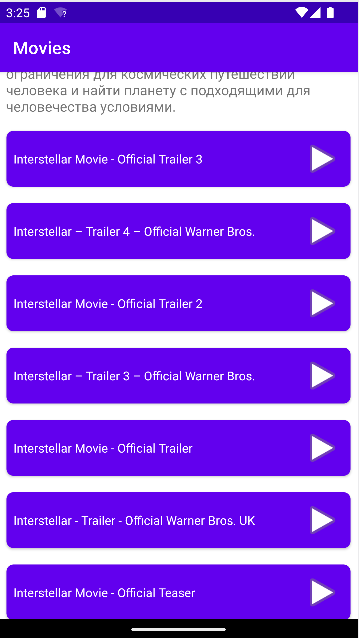

# Movies
Приложение для подбора фильмов, работает с помощью [API кинопоиска](https://kinopoisk.dev/)

Используемые библиотеки:
  + Retrofit
  + RxJava
  + Room
  + Glide
### Главный экран

### Детальная информация о фильме
Возможность добавления в избранное

### Просмотр трейлеров
При нажатии переходит в браузер

### Отзывы
Позитивные, нейтральные и негативные

### Избранное

